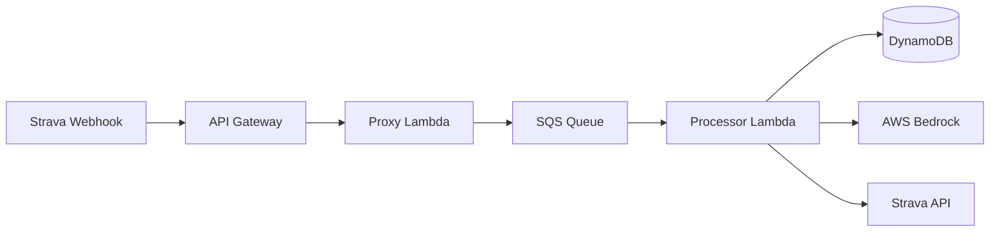

# Strava Ride Scribe

Serverless application that automatically generates Strava activity descriptions using AI.

## Overview

- Receives webhook events when Strava activities are created
- Fetches activity details (distance, elevation, speed, segments, etc.)
- Generates a description using AWS Bedrock (Claude)
- Updates the activity description in Strava

## Architecture



## AWS Infrastructure

- **API Gateway** - HTTP endpoint for Strava webhooks and OAuth
- **Lambda (Proxy)** - Routes incoming requests, queues events
- **Lambda (Processor)** - Async worker that generates descriptions
- **SQS** - Message queue with dead-letter queue for retries
- **DynamoDB** - Stores encrypted OAuth tokens and processed activities
- **Bedrock** - Claude model for description generation
- **S3** - Lambda deployment packages
- **CloudWatch** - Logging (30-day retention)

## Project Structure

```
├── lambda/
│   ├── proxy/              # HTTP request handler (OAuth + webhooks)
│   └── processor/          # Async event processor
├── lib/
│   ├── api-helper/         # Strava OAuth utilities
│   ├── encryption/         # AES-256-CBC token encryption
│   └── lambda-layer/       # Shared dependencies layer
├── web/                    # Next.js landing page
├── infra/                  # Terraform — API Gateway, Lambda, SQS, DynamoDB
└── infra-web/              # Terraform — CloudFront, S3 for landing page
```

## Deployment

Deploy with Terraform from the `infra/` directory. See `infra/variables.tf` for required configuration variables. Lambda packages are auto-built via Terraform provisioners.
